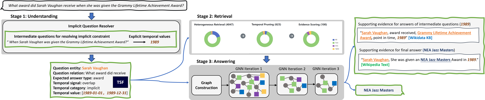

# FAITH: A Demonstration System for Faithful Temporal Question Answering

Description
------
This repo is for the FAITH demo. The video is available at [LINK](https://www.youtube.com/watch?v=O_kngz1S5zU).

*Overview of the TQA pipeline*

*Example demonstration*

### Dependencies
TQA backend is based on our WWW'24 full paper "Faithful Temporal Question Answering over Heterogeneous Sources".

For more details see our paper: [Faithful Temporal Question Answering over Heterogeneous Sources](https://dl.acm.org/doi/10.1145/3589334.3645547) and visit our project website: https://faith.mpi-inf.mpg.de.

### TQA Flask API
faith_api.py: Flask framework providing the API service.

### TQA backend
faith_backend.py: Faith backend pipeline main program.